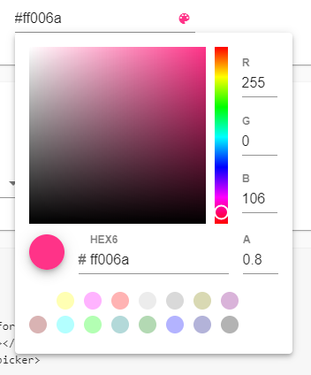
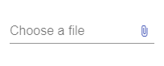

# Angular Material Extra Components (DatetimePicker, TimePicker, ColorPicker, FileInput ...) para @angular/material 19.x, 21.x y 22.x

[](https://travis-ci.com/h2qutc/angular-material-components)
[](https://www.npmjs.com/package/angular-material-components)

## Descripción

Esta librería de Angular Material proporciona componentes adicionales para tus proyectos, incluyendo un selector de fecha y hora (DatetimePicker), selector de tiempo (TimePicker), selector de color (ColorPicker), y entrada de archivos (FileInput).

Si tienes alguna pregunta, sugerencia o encuentras un problema, no dudes en contactarnos o abrir un [issue](https://github.com/tu-usuario/tu-repo/issues). También son bienvenidas las contribuciones mediante PRs.

Si encuentras útil este proyecto, por favor apóyanos con una estrella ⭐ en GitHub.

## DEMO Angular Material Components

Prueba la demostración y consulta la documentación:

<!-- [DEMO EN VIVO Y DOCUMENTACIÓN](https://tu-usuario.github.io/tu-repo/) -->

Elige la versión correspondiente a tu versión de Angular:

| Angular | `@hrefcl/datetime-picker` / `@hrefcl/moment-adapter` | `@hrefcl/color-picker` / `@hrefcl/file-input` |
| ------- | ---------------------------------------------------- | --------------------------------------------- |
| 22      | 22.x (TypeScript 6.0)                                | no publicado                                  |
| 21      | 21.x                                                 | no publicado                                  |
| 19      | 19.x                                                 | 19.x                                          |

Cambios por versión en [CHANGELOG.md](CHANGELOG.md).

### Selector de Fecha y Hora (Datetime Picker)

[](https://www.npmjs.com/package/@hrefcl/datetime-picker)
[](https://www.npmjs.com/package/@hrefcl/datetime-picker)

**Instalación:**

```bash
npm install --save @hrefcl/datetime-picker
# Con Moment.js como adaptador de fechas:
npm install --save @hrefcl/moment-adapter moment
```

**Ejemplo de uso:**

```html
<mat-form-field>
  <mat-label>Selecciona fecha y hora</mat-label>
  <input matInput [ngxMatDatetimePicker]="picker" placeholder="Elige una fecha y hora">
  <ngx-mat-datetime-picker #picker></ngx-mat-datetime-picker>
</mat-form-field>
```

**Vista previa:**


---

### Selector de Color (Color Picker)

[](https://www.npmjs.com/package/@hrefcl/color-picker)
[](https://www.npmjs.com/package/@hrefcl/color-picker)

**Instalación:**

```bash
npm install --save @hrefcl/color-picker
```

**Ejemplo de uso:**

```html
<ngx-mat-color-picker></ngx-mat-color-picker>
```

**Vista previa:**



---

### Entrada de Archivos (File Input)

[](https://www.npmjs.com/package/@hrefcl/file-input)
[](https://www.npmjs.com/package/@hrefcl/file-input)

**Instalación:**

```bash
npm install --save @hrefcl/file-input
```

**Ejemplo de uso:**

```html
<ngx-mat-file-input></ngx-mat-file-input>
```

**Vista previa:**



---

### Temas

Para aplicar estilos a tus componentes, puedes usar temas predefinidos de Angular Material. Consulta más detalles en [Temas de Angular Material](https://material.angular.io/guide/theming#using-a-pre-built-theme).

Además, agrega la fuente de iconos de Material Design a tu archivo `index.html`:

```html
<link href="https://fonts.googleapis.com/icon?family=Material+Icons&display=block" rel="stylesheet">
```

## Licencia

Este proyecto está licenciado bajo la Licencia MIT.

---

Esto debería ser suficiente para que tu fork esté claro, en español y sin referencias innecesarias al repositorio anterior. 😊
